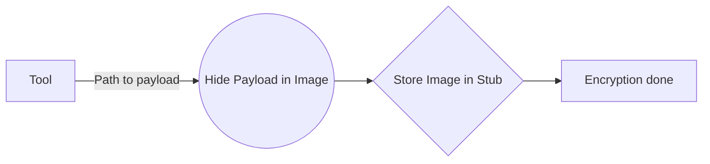

# Welcome to StegaCrypt!

StegaCrypt is a tool based on steganography. It offers encryption in one image. The source file is saved with an image of your choice, attached to the file and decrypted at runtime.

# What is LSB-Steganography?
LSB-Steganography is a steganography technique in which we hide messages inside an image by replacing Least significant bit of image with the bits of message to be hidden.  

By modifying only the first most right bit of an image we can insert our secret message and it also make the picture unnoticeable, but if our message is too large it will start modifying the second right most bit and so on and an attacker can notice the changes in picture.

# Files supported

The following file formats are currently supported:

Image formats:
PNG, BMP, JPEG

PE/EXE formats:
.NET

## Procedure

How the crypter works:

So after the encryption the payload is hidden inside a resource file within the final executable. This makes it harder for antivirus software to detect malicious code.

# Software intention
This software is intended to teach various techniques of steganography. For educational purposes only. This is a proof of concept.
