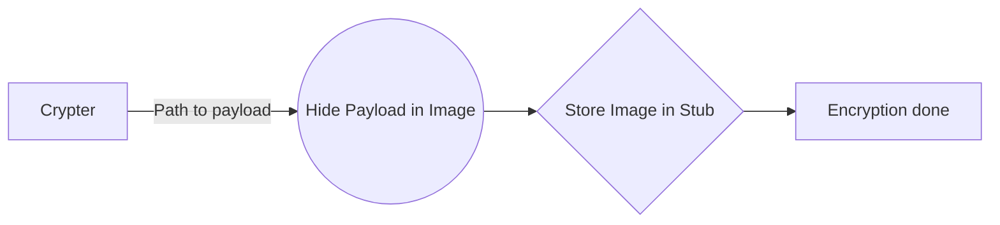

# Welcome to StegaCrypt!

StegaCrypt is a crypter based on steganography. It offers encryption in one image. The source file is saved with an image of your choice, attached to the file and decrypted at runtime.

Detection on release date :
4/38

# Files supported

The following file formats are currently supported:

Image formats:
PNG, BMP, JPEG

PE/EXE formats:
.NET

## Procedure

How the crypter works:

So after the encryption the payload is hidden inside a resource file within the final executable. This makes it harder for antivirus software to detect malicious code.
